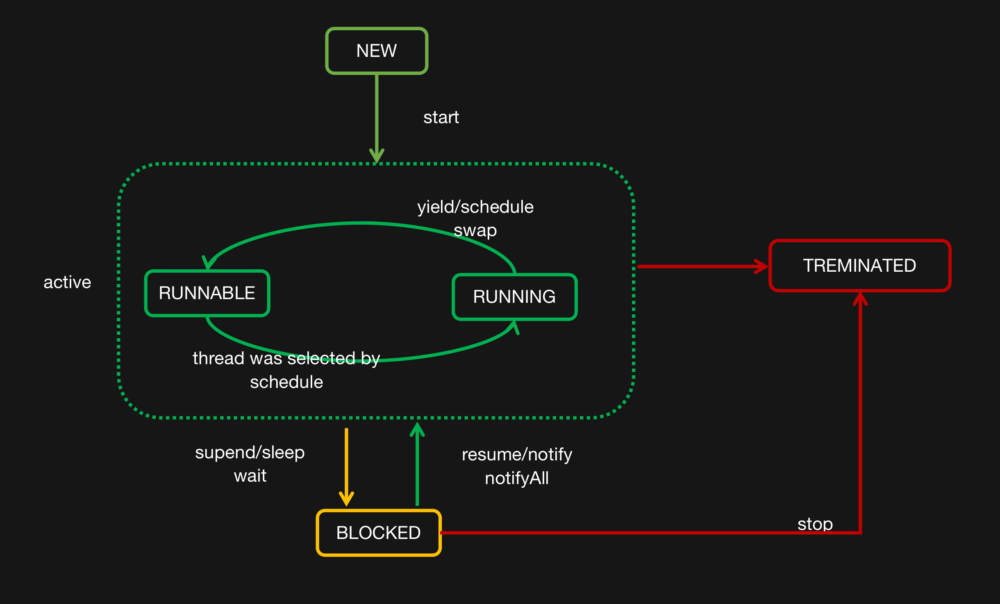

# Java高并发编程详解

## 第一部分 多线程基础

## 第1章 快速认识线程

### 1.1线程介绍

#### 1.2快速创建并启动一个线程

准确的讲，创建线程只有一种方式那就是构造Thread类，而实现线程的执行单元则有两种方式：

- 1.重写Thread的run方法，

- 2.实现Runnable接口的run方法，并且将Runnable实例用作构造Thread的参数。

Thread.java中的源码注释
There are two ways to create a new thread of execution. One is to declare a class to be a subclass of Thread. 
This subclass should override the run method of class Thread. 
An instance of the subclass can then be allocated and started.
For example, a thread that computes primes larger than a stated value could be written as follows:
```java
      class PrimeThread extends Thread {
          long minPrime;
          PrimeThread(long minPrime) {
              this.minPrime = minPrime;
          }

          public void run() {
              // compute primes larger than minPrime
               . . .
          }
      }
```

The following code would then create a thread and start it running:
```java
PrimeThread p = new PrimeThread(143);
p.start();
```

The other way to create a thread is to declare a class that implements the Runnable interface. 
That class then implements the run method. 
An instance of the class can then be allocated, passed as an argument when creating Thread, and started. 
The same example in this other style looks like the following:
```java
      class PrimeRun implements Runnable {
          long minPrime;
          PrimeRun(long minPrime) {
              this.minPrime = minPrime;
          }
 
          public void run() {
              // compute primes larger than minPrime
               . . .
          }
      }
```

#### 1.3 线程的生命周期
参考Thread.java中有一个枚举类State,定义了以下6中状态
```java
    public enum State {
        /**
         * Thread state for a thread which has not yet started.
         */
        NEW,

        /**
         * Thread state for a runnable thread.  A thread in the runnable
         * state is executing in the Java virtual machine but it may
         * be waiting for other resources from the operating system
         * such as processor.
         */
        RUNNABLE,

        /**
         * Thread state for a thread blocked waiting for a monitor lock.
         * A thread in the blocked state is waiting for a monitor lock
         * to enter a synchronized block/method or
         * reenter a synchronized block/method after calling
         * {@link Object#wait() Object.wait}.
         */
        BLOCKED,

        /**
         * Thread state for a waiting thread.
         * A thread is in the waiting state due to calling one of the
         * following methods:
         * <ul>
         *   <li>{@link Object#wait() Object.wait} with no timeout</li>
         *   <li>{@link #join() Thread.join} with no timeout</li>
         *   <li>{@link LockSupport#park() LockSupport.park}</li>
         * </ul>
         *
         * <p>A thread in the waiting state is waiting for another thread to
         * perform a particular action.
         *
         * For example, a thread that has called <tt>Object.wait()</tt>
         * on an object is waiting for another thread to call
         * <tt>Object.notify()</tt> or <tt>Object.notifyAll()</tt> on
         * that object. A thread that has called <tt>Thread.join()</tt>
         * is waiting for a specified thread to terminate.
         */
        WAITING,

        /**
         * Thread state for a waiting thread with a specified waiting time.
         * A thread is in the timed waiting state due to calling one of
         * the following methods with a specified positive waiting time:
         * <ul>
         *   <li>{@link #sleep Thread.sleep}</li>
         *   <li>{@link Object#wait(long) Object.wait} with timeout</li>
         *   <li>{@link #join(long) Thread.join} with timeout</li>
         *   <li>{@link LockSupport#parkNanos LockSupport.parkNanos}</li>
         *   <li>{@link LockSupport#parkUntil LockSupport.parkUntil}</li>
         * </ul>
         */
        TIMED_WAITING,

        /**
         * Thread state for a terminated thread.
         * The thread has completed execution.
         */
        TERMINATED;
    }
```





