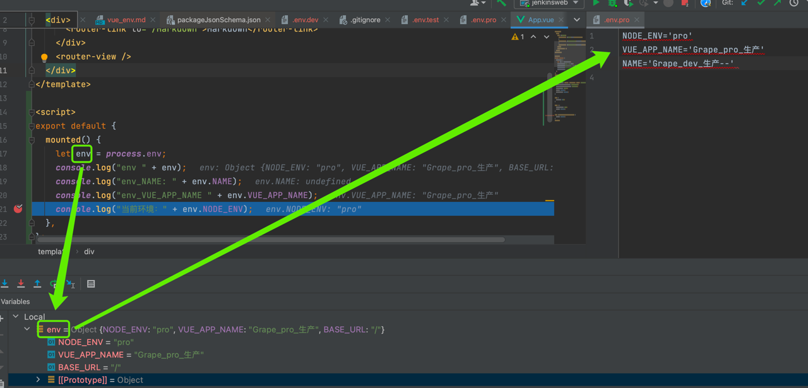

# vue env

[好东西:Vue CLI 模式和环境变量](https://cli.vuejs.org/zh/guide/mode-and-env.html#%E7%8E%AF%E5%A2%83%E5%8F%98%E9%87%8F)

## 在package.json里添加脚本
```json
"scripts": {
    "serve-dev": "vue-cli-service serve --mode dev",
    "build_dev": "vue-cli-service build --mode dev",
    "serve-test": "vue-cli-service serve --mode test",
    "build_test": "vue-cli-service build --mode test",
    "serve-pro": "vue-cli-service serve --mode pro",
    "build_pro": "vue-cli-service build --mode pro",
    "lint": "vue-cli-service lint"
  },
```

## 在项目根目录创建环境配置文件 .env.dev
```yaml
NODE_ENV='pro'
VUE_APP_NAME='Grape_pro_生产'
NAME='Grape_dev_生产--'
```

## 执行脚本
npm run serve-pro

## 对应关系


## 加载vue组件的时候输入相关环境配置信息
```js
mounted() {
    let env = process.env;
    console.log("env " + env);
    console.log("env_NAME: " + env.NAME);
    console.log("env_VUE_APP_NAME " + env.VUE_APP_NAME);
    console.log("当前环境：" + env.NODE_ENV);
  },
```
