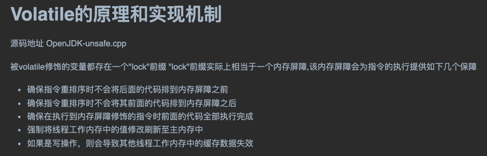

# 第2章 Java内存区域与内存溢出异常

## 2.1概述

## 2.2运行时数据区域

### 2.2.1 程序计数器 Program Counter Register

**程序计数器**是一块较小的内存空间，它可以看作是当前线程所执行字节码的**行号指示器**。

### 2.2.2 Java虚拟机栈 Java Virtual Machine Stack 

<font color="dd0000">Java虚拟机栈</font>是**线程私有**的。java虚拟机栈描述的是<font color="dd0000">Java方法执行的线程内存模型</font>：每个方法被执行的时候，java虚拟机都会同步创建一个栈桢用于存储局部变量表，操作数栈，动态连接，方法出口等信息。

### 2.2.3 本地方法栈 Native Method Stack

Hot-spot虚拟机直接把本地方法栈和虚拟机栈合二为一。本地方法栈也会在栈深度溢出或者栈扩展失败时分别抛出StackOverflowError和OutOfMnenmoryError异常。

### 2.2.4 Java堆 Java Heap

Java堆是被所有线程共享等一块内存区域，在虚拟机启动时创建。
The Java heap is a memory area shared by all threads and created when the virtual machine starts. 

此内存区域的唯一目的就是存放对象实例。
The sole purpose of this memory area is to store object instances

如果从分配内存的角度看，所有线程共享的Java堆中可以划分多个线程私有的分配缓冲区（Thread Local Allocation Buffer,TLAB)
,以提升对象分配时的效率。Java堆可以通过参数-Xmx和-Xms设定。如果在Java堆中没有内存完成实例分配，并且堆也无法再扩展时，Java虚拟机将会抛出OutOfMenoryError异常。

### 2.2.5 方法区 Method Area

方法区和java堆一样，是各个线程共享的内存区域。它用于存储已被虚拟机加载的类型信息、常量、静态变量、即时编译器编译后的代码缓存等数据。

### 2.2.6 运行时常量池 Runtime Constant Pool

### 2.2.7 直接内存 Direct Memory

## 2.3 HotSpot虚拟机对象探秘

### 2.3.1 对象的创建
new指令。
1、检查这个指令的参数能否在常量池中定位到一个类的符号引用
   检查这个符号引用是否已经加载、解析和初始化过。(若没有，执行类加载)
2、虚拟机为新生对象分配内存。
3、虚拟机将分配的内存空间(但不包括对象头)都初始化为零值(如果使用了TLAB，这一项工作也可以提前至TLAB分配时顺便进行)
4、虚拟机对对象进行必要的设置
5、构造函数(即Class文件中的<init>()方法)

> 指针碰撞


假设Java堆中内存是绝对规整的，所有被使用过的内存都被放在一边，
空闲的内存被放在另一边，中间放着一个指针作为分界点的指示器，
那所分配内存就是仅仅把那个指针向空闲空间方向挪动一段于对象大小相等的距离，
这种分配方式称为""指针碰撞"(Bump The Pointer)


### 2.3.2 对象的内存布局

​		在HotSpot虚拟机里，对象在对内存中的存储布局可以划分为三个部分：<font color="#dd0000">对象头（Header）</font>、<font color="#dd0000">实例数据（Instance Data）</font>和<font color="#dd0000">对齐填充（Padding）</font>。

​		HotSpot虚拟机对象的对象头部分包含两类信息。第一类用于存储对象自身的运行时数据，如**哈希码**（HashCode）、**GC分代年龄**、**锁状态标志**、**线程持有的锁**、**偏向线程ID**、**偏向时间戳**等，官方称为“***Mark Word***”。Mark Word被设计成一个有着动态定义的数据结构，以便在极小的空间内存存储尽量多的数据。例如在32位的HotSpot虚拟机中，如对象为被同步锁锁定的状态下，Mark Word的32个比特存储空间中的25个比特用于存储对象的哈希码，4个比特用于存储对象的分代年龄，2个比特用与存储锁标识位，1个比特固定为0。

​		对象头的另一部分是类型指针，即对象指向它的类型元数据的指针，java虚拟机通过这个指针来确定该对象是哪个类的实例。

实例数据：是对象真正存储的有效信息，即我们在程序代码里所定义的各种类型的字段内容。

​		对象的第三部分是对齐填充，它仅仅起占位符的作用。由于HotSpot虚拟机的自动内存管理系统要求对象起始地址必须是8字节的整数倍。如果对象实例数据部分没有对齐的话，就需要通过对齐填充来补全。

# 第3章 垃圾收集器与内存分配策略

## 3.1 概述

## 3.2 对象存活

### 3.2.1 引用计数法 Reference Counting

​		在对象中添加一个引用计数器，每当有一个地方引用它时，计数器加1；引用失效时，计数器值就减1.任何时刻计数器为零的对象就是不可能再被使用的。

​		缺点：很难解决对象之间互相引用的问题。

### 3.2.2 可达性分析算法 Reachability Analysis

​		通过一系列称为“GC Roots”的根对象作为起始节点集，从这些节点开始，根据引用关系向下搜索，搜索过程所走过的路径称为“引用链”(Reference Chain)，如果某个对象到GC Roots间没有任何引用链，则证明此对象是不可能再被使用的。

### 3.2.3 再谈引用

#### Java引用

- <font color="#00dd00">强引用</font>

  程序代码中普遍存在的引用赋值。

- <font color="#00dd00">软引用</font>

  有用但非必需的对象。在系统将要发生内存溢出异常时，会把这些对象列进回收范围进行二次回收，如果这次回收还没有足够的内存，才会抛出溢出异常。

- <font color="#00dd00">弱引用</font>

  非必需对象。被弱引用关联的对象只能生存到下一次垃圾收集发生为止。

- <font color="#00dd00">虚引用</font>

  为一个对象设置虚引用关联的目的是只为零能在这个对象被收集器回收时收到一个系统通知。在JDK1.2版本后提供了PhantomReference来实现虚引用。

### 3.2.4 生存还是死亡？

### 3.2.5 回收方法区

## 3.3 垃圾收集算法

​		垃圾收集算法可以划分为 <font color="#dd0000">引用计数式垃圾收集（Reference Counting GC) </font> 和<font color="#dd0000">追踪式垃圾收集（Tracing GC)</font>。这两类也常被称作“直接垃圾收集”和“间接垃圾收集”。

### 3.3.1 分代收集理论

​		设计者一般至少会把Java堆划分为新生代（Young Generation）和老年代（Old Generation）两个区域。顾名思义，在新生代中，每次垃圾收集时都发现有大批对象死去，而每次回收后存活的少量对象，将会逐步晋升到老年代中存放。

### 3.3.2 标记-清除算法

​		首先标记出所有需要回收的对象，在标记完后，统一回收掉所有被标记过的对象（也可以反过来，标记存活的对象，统一回收所有未被标记的对象）。

​		缺点：效率不稳定和空间碎片化

### 3.3.3 标记-复制算法

​		一种称为“半区复制”（SemispaceCopying）的垃圾收集算法，它将可用的内存区域按容量大小划分为大小相等的两块，每次只使用一种的一块。当这一块的内存用完了，就将还存活着的对象复制到另一块上面，然后再把已使用过的内存空间一次性清理掉。

代价：将可用内存缩小为两原来的一半。

### 3.3.4 标记-整理算法
标记过程与“标记-清除”算法一样，后续是让所有存活的对象都想内存空间一端移动，然后直接清理掉边界以外的内存。

## 3.4 HotSpot的算法细节实现
### 3.4.1 根节点枚举
### 3.4.2 安全点
### 3.4.3 安全区域
### 3.4.4 记忆集于卡表
### 3.4.5 写屏障
### 3.4.6 并发的可达性分析
<font color="#dd0000">三色标记</font>
- 白色 表示对象尚未被垃圾收集器访问过
- 黑色 表示对象已经被垃圾收集器访问过，且这个对象的所有引用都已经被扫描过
- 灰色 表示对象已经被垃圾收集器访问过，但这个对象上至少存在一个引用还没有被扫描过

<font color="#dd0000">并发扫描时对象消失问题</font>

两种解决方法:<font color="#00dd00">增量更新</font>(Incremental Update)和<font color="#00dd00">原始快照</font>(Snapshot At The Beginning,SATB)
- 增量更新:当黑色对象插入新的指向白色对象的引用关系时，将这个<font color="#FFA500">新插入的引用</font>记录下来，
等并发扫描结束后，再将这些记录过的引用关系中的黑色对象为根，重新扫描一次。
- 原始快照:当灰色对象要删除指向白色对象的引用关系时，将这个 <font color="#FFA500">删除的引用</font>记录下来，
等并发扫描结束后，再将这些记录过的引用关系中的灰色对象为根，重新扫描一次。

3.7.4 垃圾收集器参数总结

|   参数   |   描述   |
| ---- | ---- |
|  UseSerialGC    |  虚拟机运行在Client模式下的默认值，打开此开关后，使用Serial + SerialOld的收集器组合进行内存回收    |
| -XX:PrintGCDetails | 发生垃圾收集行为时打印内存回收日志 |
|      |      |

## 3.8 实战：内存分配于回收策略

### 3.8.1 对象优先在Eden分配

大多数情况下，对象在新生代Eden区中分配。当Eden区没有足够空间进行分配时，虚拟机将发起一次MinorGC。

### 3.8.2 大对象直接进入老年代

参数:-XX:PretenureSizeThreshold,指定大于该设置值的对象直接在老年代分配，避免在Eden区及两个Survivor区之间来回复制。

### 3.8.3 长期存活的对象将进入老年代

​		虚拟机给每个对象定义了一个<font color="#00dd00">对象年龄(Age)计数器</font>，存储在对象头中。对象通常在Eden区里诞生，如果经过第一次Minor GC后仍然存活，并且能被Survivor容纳的话，该对象会被移动到Survivor空间中，并且将其对象年龄设为1岁。对象在Sruvivor区中每熬过一次MinorGC，年龄就增加1岁，当它的年龄增加到一定程度(默认为15)，就会晋升到老年代中。 对象晋升老年代的阈值，可以通过参数-XX:MaxTenuringThreshold设置。

### 3.8.4 对象动态年龄判定

### 3.8.5 空间分配担保

​		在发生MinorGC之前，虚拟机必须先检查老年代最大可用的连续空间是否大于新生代所有对象总空间，如果条件成立，那这一次MinroGC可以确保是安全的。如果不成立，则虚拟机会先查看-XX:HandlePromotionFailure的参数的设置值是否允许担保失败；如果允许，那会继续检查老年代最大可用的连续空间是否大于历次晋升到老年代对象的平均大小，如果大于，将尝试进行一次MinorGC，如果小于，或者-XX:HandlePromotionFailure设置不允许冒险，那这时就要改为进行一次full GC。

​		<font color="#dd0000">JDK6 Update 24</font>之后的规则变为只要 <font color="#00dd00">老年代的连续空间大于新生代对象总大小或者历次晋升的平均大小，就会进行Minor GC，否则进行Full GC</font> 。

​

# 第4章 虚拟机性能监控、故障处理工具
## 4.1 概述
## 4.2 基础故障处理工具
### 4.2.1 jps 虚拟机进程状况工具
jps(JVM Process Status Tools)
可以列出正在运行的虚拟机进程，并显示虚拟机执行主类(Main Classk,main()函数所在的类)名称以及这些进程的本地虚拟机唯一ID(LVMID,Local Virtual Machine Identifer).LVMID于操作系统的进程ID(PID,Process Identifier)是一致的。

### 4.2.2 jstat 虚拟机统计信息监视工具
jstat(JVM Statistics Monitoring Tool)
用于监视虚拟机各种运行状态信息的命令工具。

### 4.2.3 jinfo Java 配置信息工具
jinfo(Configuration Info for java)
作用:实时查看和调整虚拟机各项参数

### 4.2.4 jmap Java内存映像工具
jmap(Menory Map for java)

用于生成堆转储快照

### 4.2.5 jhat 虚拟机堆转储快照分析工具

### 4.2.6 jstact Java堆栈跟踪工具
jstack(Stack Trace for java)
用于生成虚拟机当前时刻堆线程快照

# 第7章 虚拟机类加载机制

## 7.1 概述

​		Java虚拟机把描述类de数据从Class文件加载到内存，并对数据进行校验，转换解析和初始化，最终形成可以被虚拟机直接使用到Java类型，这个过程被乘称作虚拟机到类加载机制。

## 7.2 类加载到时机

​		一个类型从被加载到虚拟机内存中开始，到卸载出内存为止，它到整个生命周期将会经历加载，验证，准备，解析，初始化，使用，卸载七个阶段。其中验证、准备、解析三个部分统称为连接。

## 7.3 类加载到过程

## 7.4 类加载器

​		Java虚拟机设计团队有意把类加载阶段中到"通过一个类到全限定名来获取描述该类的二进制流"这个动作放到java虚拟机外部去实现，以便让应用程序自己决定如何去获取所需的类。实现这个动作的代码被称为"类加载器"(Class Loader)

## 7.4.1 类于类加载器

## 7.4.2 双亲委派模型

​		站在Java虚拟机的角度来看，只存在两种不同的类加载器：一种是启动类加载器（Bootstrap ClassLoader），这个类加载器使用C++语言实现，是虚拟机自身的一部分；另外一种就是其他所有的类加载器，这些类加载器都由java语言实现，独立存在于虚拟机外部，并且全都继承自抽象类java.lang.ClassLoader.绝大多数java程序都会使用到以下3个系统提供到类加载来进行加载。

- <font color="#dd0000">启动类加载器 Bootstrap Class Loader</font>

​		这个类加载器负责加载存放在<JAVA_HOME>\lib目录，或者被-Xbootclasspath参数说指定de路径中存放到，而且是java虚拟机能够识别的(按照
文件名识别，如rt.jar、tools.jar,名字不符合和的类库即使放在lib目录中也不会被加载)类库加载到虚拟机到内存中。启动类加载器无法被java程序直接
引用，用户在编写自定义类加载器时，如果需要把加载请求委派给引导类加载器去处理，那直接使用null即可。

- <font color="#dd0000">扩展类加载器 Extension Class Loader</font>

​		这个类加载器是在类sum.misc.Launcher$ExtClassLoader中以java代码的形式实现。它负责加载<JAVA_HOME>\lib\ext目录中，或者被java.ext.dirs系统变量所指定的路径中所有的类库。

- <font color="#dd0000">应用程序类加载器 Application Class Loader</font>

​		这个类加载器是由sum.misc.Launch$AppClassLoader来实现。由于应用程序类加载器是是ClassLoader类中的getSystemClassLoader(方法的返回值，所以有些场合中也称它为"系统类加载器"。它负责加载用户类路径(ClassPath)上所有的类库。

双亲委派模型要求初了顶层的启动类加载器外，其余的类加载器都应有自己的父类加载器。

​		双亲委派模型的工作过程：如果一个类加载器收到类类加载的请求，它首先不会自己去尝试加载这个类，而是把请求委派给父类加载器去完成，每一个层次的类加载器都是如此，因此所有的加载请求最终都应该传送到最顶层的启动器类加载器中，只有当父加载器返回自己无法完成这个加载请求（它的搜索范围中没有找到所需要的类）时，子加载器才会尝试自己去完成加载。

- 双亲委派模型的实现
```java
    protected Class<?> loadClass(String name, boolean resolve)
        throws ClassNotFoundException
    {
        synchronized (getClassLoadingLock(name)) {
            // First, check if the class has already been loaded
            // 检查请求的类是否已经被加载过了
            Class<?> c = findLoadedClass(name);
            if (c == null) {
                long t0 = System.nanoTime();
                try {
                    if (parent != null) {
                        // 调用父加载器的loadClass方法
                        c = parent.loadClass(name, false);
                    } else {
                        // 若父加载器为空则默认使用启动类加载器进行加载
                        c = findBootstrapClassOrNull(name);
                    }
                } catch (ClassNotFoundException e) {
                    // ClassNotFoundException thrown if class not found
                    // from the non-null parent class loader
                }

                if (c == null) {
                    // If still not found, then invoke findClass in order
                    // to find the class.
                    // 在父类加载器无法加载时,再调用本身的findClass方法来进行类加载
                    long t1 = System.nanoTime();
                    c = findClass(name);

                    // this is the defining class loader; record the stats
                    sun.misc.PerfCounter.getParentDelegationTime().addTime(t1 - t0);
                    sun.misc.PerfCounter.getFindClassTime().addElapsedTimeFrom(t1);
                    sun.misc.PerfCounter.getFindClasses().increment();
                }
            }
            if (resolve) {
                resolveClass(c);
            }
            return c;
        }
    }
```

## 7.4.3 破坏双亲委派模型
在JDK1.2之后的java.lang.ClassLoader中添加一个新的protected方法findClass(),并引导用户编写的类加载逻辑尽可能去重写这个方法。


# 第12章 java内存模型与线程

## 12.1 概述

## 12.2 硬件的效率于一致性

- "内存模型"，可以理解为在特定操作协议下，对特定的内存或高速缓存进行读写访问的过程抽象。


## 12.3 Java内存模型

### 12.3.1 主内存于工作内存

- Java内存模型的主要目的是<font color="#00dd00">定义程序中各种变量的访问规则</font>。

- Java内存模型规定所有变量都存储在主内存(Main Memory),线程的工作内存保存了被该线程使用的变量的主内存副本，线程对变量的所有操作都必须在工作内存中进行,而不能直接读写主内存中的数据。不同线程之间也无法直接访问对方工作内存中的变量，线程间变量值的传递均需要通过主内存来完成。


### 12.3.2 内存间交互操作

### 12.3.3 对于volatile型变量的特殊规则

当一个变量被定义成volatile之后，它将具备两项特性：

- 保证此变量对所有线程对可见性。这里对可见性是指当一条线程修改了这个变量对值，新值对于其他线程来说是可以立即得知。



(详情参考:[Volatile的原理和实现机制](https://github.com/zzh-1992/MyDocument/commit/c027a416bc185544fd6cf9e7774314507d7f6586))

- 禁止指令重排序优化

### 12.3.4 针对long和double型变量的特殊规则

### 12.3.5 原子性、可见性于有序性

1. 原子性
2. 可见性
   可见性就是指当一个线程修改了共享变量对值时，其他线程能够立即得知这个修改。Java内存模型是通过变量修改后将新值同步回主内存，在变量读取前从主内存刷新新值这种依赖主内存作为传递媒介对方式来实现可见性。volatile的特殊规则保证了新值能立即同步到主内存，以及每次使用前立即从主内存刷新。

### 12.3.6 先行发生原则

## 12.4 Java与线程

### 12.4.1 线程的实现

### 12.4.2 Java线程调度

### 12.4.3 状态转换

Thread.java中有一个枚举类State,定义了以下6中状态

1. 新建 New A
   thread that has not yet started is in this state.
2. 运行 Runnable
   A thread executing in the Java virtual machine is in this state.
3. 无限等待 Waiting
   A thread that is waiting indefinitely for another thread to perform a particular action is in this state.
4. 限期等待 Timed Waiting
   A thread that is waiting for another thread to perform an action for up to a specified waiting time is in this state.
5. 阻塞 Blocked
   A thread that is blocked waiting for a monitor lock is in this state.
6. 结束 Terminated
   A thread that has exited is in this state.

### 12.4.4

## 12.5

## 12.6

## 12.1

## 12.1

# 第13章 线程安全与锁优化

## 13.1概述

## 13.2线程安全

当多个线程同时访问一个对象时，如果不用考虑这些线程在运行环境下的调度和交替执行，也不需要进行额外的同步，或者在调用方进行任何其他的协调操作，调用这个对象的行为都可以获得正确的结果，那么称为这个对象是线程安全的。

### 13.2.1java语言中的线程安全

1.不可变

2.绝对线程安全

3.相对线程安全

4.线程兼容

5.线程对立

### 13.2.2 线程安全的实现方法

1.互斥同步

2.非阻塞同步

3.无同步方案

## 13.3 锁优化

- 适应性自旋

- 锁消除

- 锁膨胀

- 轻量级锁

- 偏向锁

### 13.3.1 自旋锁于自适应自旋

为了让线程等待，只需让线程执行一个忙循环(自旋)，这项技术就是所谓的自旋锁。

自旋锁在JDK1.4.2中就已经引入，默认关闭，可以使用-XX:+UseSpinging参数开启，在JDK1.6中已经改为默认开启。自旋次数的默认值是十次，用户也可以使用参数:-XX:
PreBlockSpin来自行更改。在JDK1.6中对自旋锁的优化，引入了自适应自旋。，由前一次在同一个锁上的自旋时间及锁的拥有者的状态来决定

### 13.3.2 锁消除

锁消除是指虚拟机即时编译器在运行时，对一些代码要求同步，但是对被检测到不可能存在共享数据竞争对锁进行消除。锁消除的主要判定依据来源于逃逸分析的数据支持，如果判断到一段代码中，在堆上的所有数据都不会逃逸出去被其他线程访问到，那就可以把它们当作栈上数据对待，认为它们是线程私有的，同步加锁自然就无须再进行。

### 13.3.3 锁粗化

如果虚拟机探测到有这样一串零碎的操作需要对同一个对象加锁，将会把加锁同步的范围扩展(粗化)到整个操作序列的外部。

### 13.3.4 轻量级锁

### 13.3.5 偏向锁


